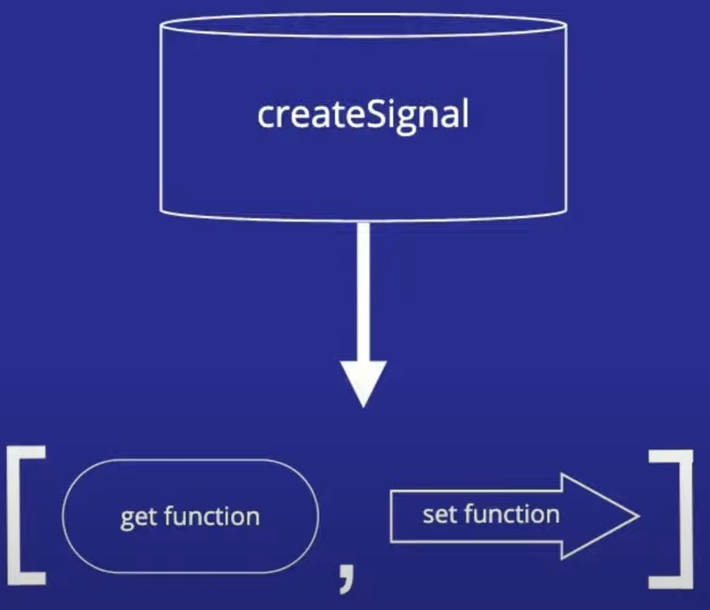
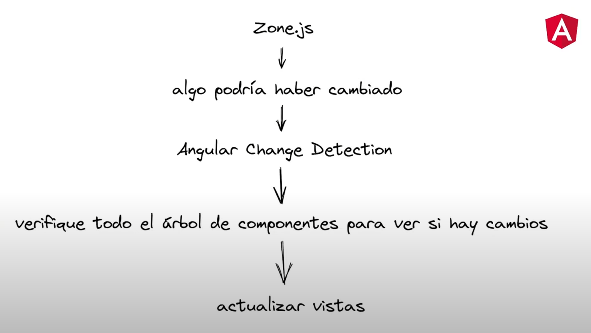
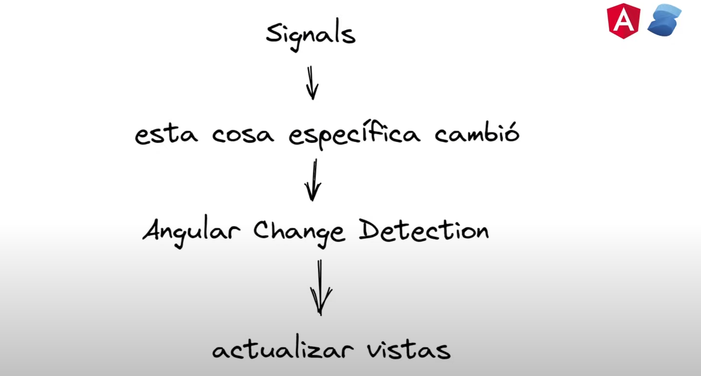
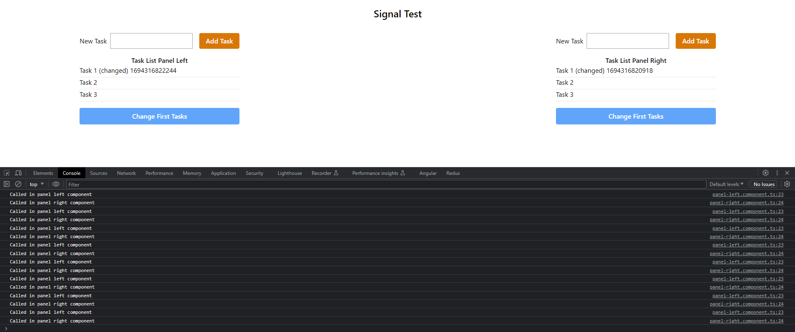

# Taller sobre Micro-frontend, Angular v16 y Qwik

## Micro-frontend

### ¿Qué son los Micro-frontends?

El micro-frontend no es mas que una separación tecnica de un dominio o subdomino de nuestro negocio. Al saber que cada negocio tiene sus propias particularidades no hay un patrón establecido que nos indique como podemos dividir cada uno de los dominios o subdominio. Por ejemplo podemos tener un header y un navbar en un unico micro-frontend pero pueden existir casos en los cuales cada uno de estos elementos pueden ser un micro-front por aparte.

Cada microfront que tengamos puede ser creado con una tecnología diferente, por ejemplo podemos tener un header hecho en react mientras tenemos un navbar creado en angualar. Pero tambien existe otro punto fuerte y es que podemos manejar multiples versiones de una misma tecnología. Por ejemplo podemos tener una aplicación hecha en Angular-js y gracias a los micro-fronteds podemos mantener el código en Angular js mientras las nuevas caracteristicas se van creando con versiones mas recientes de Angular a la par que se van migrando.

Finalmente una regla que se debe seguir al momento de trabajar con Micro-frontends es que estos no deben compartir información entre ellos para que cada dominio o subdominio sea independiente.

### ¿Cuales empresas utilizan Micro-frontend?

Especificamente las siguientes empresas están usando Micro-frontend con Module federation:

- Paypal
- Amazon
- Microsoft
- Adidas

Esto indica que actualmente los Micro-frontend son una realidad y no una moda. Lo que se debe tener en cuenta es que esta tecnología se usa para grandes proyectos en donde exista cierta complejidad, grandes equipos y una logica que puede ser complicada de tratar como un todo. Tambien podemos considerar usar los Micro-frontend cuando vemos que nuestro negocio va creciendo.

### Ventajas y desventajas de los Micro-frontend

Como todo en la vida existe en balance entre las ventajas y las desventjas y los Micro-frontends no son la exepción. A continuación veremos algunas ventajas y desventajas de su uso:

#### Ventajas

- Desacoplamiento: Cada Micro-frontend lo podemos ver como un elemento que puede ser desarrollado, desplegado y testiado de manera totalmente independiente. Este punto permite que a nivel de desarrollo los equipos tengan mas libertar a la hora de crear o probar nuevas caracteristicas sin correr el riesgo de dañar o entorpecer el trabajo de otros equipos.

- Desarrollo en paralelo: Otra ventaja de usar los Micro-frontend es que podemos tener varios equipos trabajando en paralelo sin inteferir entre ellos. Esto tambien ayuda a que cuando hayan nuevos miembros en el equipo su onboarding sea mucho mas rapido y facil de llevar.

- Agnositico a la tecnología: Cada Micro-front puede ser desarrollado usando la tecnología que mas se acomode a la necesidad que se debe cubrir. Esto permite que se puedan tener equipos con especialistas en cada tecnologia a utilizar. Pero otro punto a favor es que podemos tener diferentes versiones de una misma tecnologia.

- Reducir el riesgo: Al tener un codigo desacoplado, que se pueda desarrollar por multiples equipos y que sea agnostico a la tecnologia nos va a permitir reducir el riesgo de fallos en nuestra aplicacion de manera significativa.

#### Desventajas

- Complejidad adicional: Al tener multiples entornos, repositorios,y CI/CD pipelines la complejidad del proceso de desarrollo puede aumentar.

- Performance: Si un Micro-front no esta bien optimizado puede causar problemas en nuestra aplicación. Es por eso que debemos tener cuidado en especial en los momentos de carga inicial.

### Creando el workspace

Para los fines de este taller se va a crear un workspace que va a contener multiples aplicaciones. Usamos el siguiente comando para tener un workspace:

```txt
ng new [nombre_workspace] --no-create-application
```

Ahora vamos a crear el nucleo de nuestro micro-fronted, es cual no es mas que una aplicación que para nuestro caso llamaremos shell y lo crearemos por medio del siguiente comando:

```ts
ng g application shell
```

A continuación vamos a crear los demas micro-fronteds de nuestra aplicación usando el siguiente comando:

```ts
ng g application products
```

### Implementando angular-architects/module-federation

Este plugin nos va a permitir configurar nuestro micro-front. Para tener mas información podemos visitar el [repositorio oficial](https://github.com/angular-architects/module-federation-plugin/blob/main/libs/mf/README.md). Una versión resumida de los pasos son:

1. Determinamos cual va a ser nuestra aplicación host por medio del siguiente comando

   ```ts
    ng add @angular-architects/module-federation --project [nombre_proyecto] --port 5500 --type host
   ```

   Usamos el schematic @angular-architects/module-federation y le indicamos:

   - project: Nombre del proyecto que sera el host de nuestro Micro-front, en este caso sería el proyecto shell.
   - port: El puerto por el cual va a correr nuestra app.
   - type: El tipo de Micro-frontend que será, en este caso será de tipo host que basicamente indica que es la parte principal de nuestro Micro-front.

2. Configurar los Micro-frontend que integraran nuestra app. Para ello usamos el siguiente comando:

   ```ts
   ng add @angular-architects/module-federation --project [nombre_producto] --port 5600 --type remote
   ```

   Usamos el schematic @angular-architects/module-federation y le indicamos:

   - project: Nombre del proyecto que hara parte de nuestro Micro-front, en este caso sería el proyecto products.
   - port: El puerto por el cual va a correr nuestra ese proyecto.
   - type: El tipo de Micro-frontend que será, en este caso será de tipo remote que basicamente indica que es una parte de nuestro Micro-front.

Con estos dos comandos se van configurar y modificar varios archivos de nuestro workspace para que nuestro micro-frontend funcione.

### Configurando Webpack

Si nos ubicamos en el archivo **webpack.config.js** de nuestro proyecto shell, vamos a encontrar las siguientes secciones:

- Una sección llamada remotes. En esta sección basicamente podemos configurar los demas micro-frontends que podemos consumir. Para consumirlos las aplicaciones remote (products en este caso) debemos tener un bundle de javascript de dicha aplicación.

  ```ts
  remotes: {
      products: "http://localhost:4200/remoteEntry.js",
    },
  ```

- Una sección llamada shared: Es esta sección estamos indicando que estamos compartiendo todas nuestras dependencias con los demas micro-fronted

  ```ts
  shared: {
    ...shareAll({
      singleton: true,
      strictVersion: true,
      requiredVersion: "auto",
    }),
  },
  ```

  - singleton: true: Indica que solamente tenemos una unica instancia de los vendor.
  - strictVersion: true y requiredVersion: Estamos limitando que las versiones de nuestros paquetes sean las mismas, es decir si tenemos una dependencia llamada **alejoDev** en su version 1.0.0 este paquede debe tener la misma versión tanto en el host como en los remotes.

A continuación vamos a ver la configuracion de un **webpack.config.js** de un proyecto remote, en el vamos a encontrar secciones muy parecidas con la diferencia de:

- expose: en ella vamos a poder agrupar el modulo o los modulos que deseamos compartir desde nuestra aplicación remote.

  ```ts
  exposes: {
    "./Component": "./projects/products/src/app/app.component.ts",
  },
  ```

  En el ejemplo anterior estamos exponiendo el **app.componente.ts** de nuestro proyecto de **products** con el nombre **./Component**.

Para ejecutar nuestro micro-frontend podemos usar el siguiente comando:

```ts
npm run run:all
```

Este comando fue configurado cuando hicimos las configuraciones de angular-architects/module-federation

### Configurar Remote Shell

Configurar nuestro remote shell nos permite ejecutar comandos en los diferentes micro frontends y realizar tareas de administración desde un punto de control.

Veamos como configurar los remote shell nuestro micro frontend. Lo primero que haremos es acceder al **webpack.config.js** de nuestro proyecto **product** y accedemos a los **exposes** en donde podremos exponer los elementos de nuestro proyecto para que sean consumidos por nuestro proyecto shell.

Para el ejemplo hemos realizado acciones tipicas de un proyecto angular como crear un modulo y sus componentes, configurar sus rutas y usar el **router-outlet** para mostrar la información. El paso siguiente es exponer dicho modulo en la sección **exposes** de su respectivo webpack.config.js, algo parecido a lo siguiente:

```ts
exposes: {
  // "./nombre_exposedModule": "Path del elemento a exponer",
  "./listProduct": "./projects/products/src/app/products/products.module.ts",
},
```

Con esta configuración hemos creado y configurado un modulo de nuestro micro-frontend para ser consumido desde nuestra shell.

Para consumir micro-frontend de manera dinamica, es decir como si fuera un modulo más de nuestra aplicación shell, usamos la función **loadRemoteModule** de **@angular-architects/module-federation**. Veamos como:

```ts
import { loadRemoteModule } from "@angular-architects/module-federation";
import { NgModule } from "@angular/core";
import { RouterModule, Routes } from "@angular/router";

const routes: Routes = [
  {
    path: "products",
    loadChildren: () =>
      loadRemoteModule({
        type: "module",
        remoteEntry: "http://localhost:5600/remoteEntry.js",
        exposedModule: "./listProduct",
      }),
  },
];

@NgModule({
  imports: [RouterModule.forRoot(routes)],
  exports: [RouterModule],
})
export class AppRoutingModule {}
```

En el ejemplo anterior vemos que estamos creado un ruta que tiene su path pero que en lugar de llamar a un modulo o un componente, esta llamando a todo un micro-frontend por medio de la la función **loadRemoteModule** de **@angular-architects/module-federation**. En la función pasamos la siguiente información:

- type: El tipo de elemento que va a cargar. Puede ser manifets, module o script.
- remoteEntry: Es la ruta de acceso al remote entry de nuestro micro-front a cargar.
- exposedModule: Nombre que le colocamos al elemento que se expuso de nuestro micro-front.

Por ultimo solamente debemos usar nuestro **router-outlet** en el **app.componente.html** de nuestro proyecto shell, lanzar nuestra aplicación y acceder a la ruta /products para que nuestro micro-front **products** sea cargado de manera dinamica desde nuestra shell.

### Nota

Al momento de cargar nuestros micro-front nos va a lanzar un error debido a que no hemos definido la propiedad publicPath. Para configutar esta propiedad debemos realizar los siguientes pasos:

1. En nuestro **webpack.config.js**, en lugar de exponer directamente nuestro withModuleFederationPlugin lo guardamos en una constante.

2. por medio de la constante accedemos a la propiedad output y de ahí a la propiedad publicPath y asignamos la ruta de acceso a nuestro micro-frontend.

3. exportamos la constante que creamos de nuestro micro-frontend products.

Veamos un ejemplo:

```ts
const { shareAll, withModuleFederationPlugin } = require("@angular-architects/module-federation/webpack");

const productMF = withModuleFederationPlugin({
  name: "products",

  exposes: {
    "./listProduct": "./projects/products/src/app/products/products.module.ts",
  },

  shared: {
    ...shareAll({
      singleton: true,
      strictVersion: true,
      requiredVersion: "auto",
    }),
  },
});

productMF.output.publicPath = "http://localhost:5600/";

module.exports = productMF;
```

### Datos de deploy

```ts
Site Created NAVBAR

Admin URL: https://app.netlify.com/sites/navbar-react-mf
URL:       https://navbar-react-mf.netlify.app
Site ID:   98424071-04bb-4fbd-8e78-27df525ffe42

Site already linked to "undefined"
Admin url: undefined

To unlink this site, run: netlify unlink

------

Site Created SHELL

Admin URL: https://app.netlify.com/sites/shell-mf
URL:       https://shell-mf.netlify.app
Site ID:   7cafb103-35e5-4834-bdbe-24fe643bb70c

Site already linked to "undefined"
Admin url: undefined

To unlink this site, run: netlify unlink

------

Site Created PRODUCTS

Admin URL: https://app.netlify.com/sites/products-mf
URL:       https://products-mf.netlify.app
Site ID:   92b75c21-fc8a-451e-8259-f130d1ce256d

Site already linked to "undefined"
Admin url: undefined

To unlink this site, run: netlify unlink
```

## Angular 16

### Standalone Components

Los standalone components son componentes, pipes o directivas que no necesitan estar dentro de un modulo para existir ya que el mismo es autonomo y puede invocar los elementos que necesite para cumplir su función.

Se recomienda leer el siguiente [articulo](https://codigoencasa.com/standalone-components-en-angular/) para conocer mucho más a fondo sobre los standalone component.

Para crear un standalone componente podemos:

1. Usar el siguiente comando:

   ```ts
   ng generate componente [path/component_name] --standalone
   ```

2. Usar la propiedad **standalone: true** en el @ngComponente para convertir un componente creado un standalone.

   ```ts
   @Component({
     selector: "app-test",
     templateUrl: "./test.component.html",
     standalone: true,
   })
   export class TestComponent {}
   ```

Si necesitamos importar o injectar algún modulo o servicio lo podemos hacer la siguiente manera:

```ts
@Component({
  selector: "app-test",
  templateUrl: "./test.component.html",
  standalone: true,
  imports: [TitleCasePipe, CurrencyPipe, AddToCardComponent, QuantityChangerComponent, NgIf, ImageComponent],
  providers: [TestServices],
})
export class TestComponent {}
```

En caso de que querramos aplicar lazy loading a un standalone componente debemos usar la siguiente función:

```ts
 {
    path: 'test',
    loadComponent: () => import('Path_standalone_componente').then(mod => mod.ComponentName)
  },
```

### Input Require

Otra novedad que viene en Angular 16 es que ahora podemos indicar si un input es requerido o no, para hacerlo usamos la siguiente sintaxis:

```ts
@Component({
  selector: "app-test",
  templateUrl: "./test.component.html",
  standalone: true,
})
export class TestComponent {
  @Input({ required: true }) public productId!: string;
}
```

De esta manera podemos asegurarnos de pedir la información que necesitemos para que nuestra aplicación no se rompa.

### Funciones como RouterGuards

A partir de la versión 16 de Angular los guard que son los encargados de proteger nuestras rutas ya no se manejan con clases sino que se deben manejar con funciones: veamos un ejemplo:

Tenemos el siguiente servicio que se encargara de indicar si un usuario esta o no autenticado:

```ts
import { Injectable } from "@angular/core";
import { BehaviorSubject, Observable } from "rxjs";

@Injectable({
  providedIn: "root",
})
export class AuthService {
  private readonly isLoggedIn$ = new BehaviorSubject<boolean>(true);

  public isAuthenticated$ = (): Observable<boolean> => {
    return this.isLoggedIn$.asObservable();
  };
}
```

Ahora veremos como es un guard por medio de una función:

```ts
import { inject } from "@angular/core";
import { CanActivateFn, Router } from "@angular/router";
import { AuthService } from "../services/auth.service";
import { take, tap } from "rxjs";

export const authGuard: CanActivateFn = (route, state) => {
  const authService = inject(AuthService);
  const router = inject(Router);
  return authService.isAuthenticated$().pipe(
    take(1),
    tap((isLoggedin) => (isLoggedin ? true : router.navigate(["/login"])))
  );
};
```

Vemos que la sintaxis es mucho mas simple y ya que es una función tambien funcionara mucho mas rapido.

### Signals

Los Signals son un nuevo modelo de reactividad implementado en [Solid.js](https://www.solidjs.com/) y que ha ganado mucha popularidad y que varios frameworks han ido implementando, entre ellos Angular. Veamos como es la estructura de un Signal en [Solid.js](https://www.solidjs.com/):

```ts
const [count, setCount] = createSignal(10);
setInterval(() => setCount(count() + 1), 1000);
return <div>Count {count()}</div>;
```

Vemos que tenemos una función llamada **createSignal** la cual nos entrega dos funciones: un **getter** y un **setter**. Si deseamos tener el valor del signal este no nos da directamente el valor sino que nos da una función (**getter**) que debemos ejecutar para saber cual es el valor actual del Signal. Este cambio es clave ya que si se compara con el hook useState de React en donde solo se obtiene el valor, la función **getter** que nos retornal el Signal por detras maneja todo un modelo de reactividad que permite a todos los interesados estar pendientes de su nuevo estado permitiendo asi saber exactamente cual fue el elemento que cambio debido a que se tiene el contexto de donde se ejecuto.


Ahora veamos como en Angular se maneja esta detección de cambios por medio de zone.js. Primero que todo aclaremos que zone.js es una libreria que se encarga de crear un **contexto de ejecución** el cual esta pendiente de todas las peticiones asincronas que se realizan con el objetivo de saber si algo ha cambiado para luego ejecutar el Angular check detection (ciclo de vida de angular) que se encarga de verificar el arbol de componentes para ver si hubo cambios y por ultimo actualizar la vista.

Se debe aclarar que zone.js primero verifica si algo ha cambiado para saber si tiene que actualizar algun componente pero en el caso de que deba actualizarse primero debera recorrer todo el arbol de componentes. En este punto es donde podemos tener algunas oportunidades de mejora gracias a los signals.



Ahora veamos cual es la nueva propuesta de reactividad en Angular por medio de los Signals. Gracias a los métodos **getter** y **setter** que nos proveen los Signals podemos saber cual es el contexto de ejecución y suscribirnos a él, de esta forma podemos conocer exactamente cual es el elemento que ha cambiado y actualizarlo sin necesidad de irlo a buscar por todo el arbol de componentes, en otras palabras se podría eliminar zoneJs.



Veamos un ejemplo de un problema clasico que ocurre en ZoneJS: Podemos observar que tenemos dos componentes independientes que representan dos formularios para ingresar tareas.

Si revisamos mas a fondo nos podemos dar cuenta que cualquier interacción en el formulario como: Darle focus a alguno de los dos inputs, o agregar una nueva tarea o actualizar la primera tarea lanza los eventos del otro formulario que en si son dos componentes independientes. Este problema se debe a que zoneJs detecta que hay un cambio pero no sabe exactamente en donde y es por eso que se ve obligado a recorrer todo el arbol de componentes para actualizar el render en base al cambio ocurrido.

Es verdad que para mitigar este error podemos ejecutar estrategias de detección de cambios como la estrategia OnPush pero esta solución requiere tener un conocimiento de ngRx, conocer mejor el modelo de reactividad para saber como se esta mutando la información. En resumen esta solución puede ser complicada de implementar.


